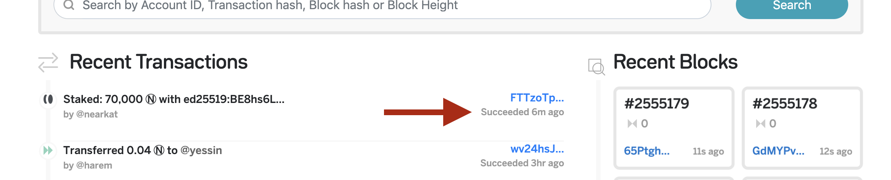

# **April 27th 2020 update: Stake Wars is back**
NEAR Protocol is ready for the next step: launch Stake Wars 2.0! We learned a lot from running together the first Stake Wars, and we worked hard to release a NEAR node that is stable and production-ready.

We are now ready to get into the next step: open Stake Wars to anyone!

Stake Wars 2.0 will test the *delegation* of tokens from users to validators. Therefore, we want you validators to be ready for the action and involve you with NEAR Protocol community as a whole.

The goals are:
- for end-users, learn the principles of proof of stake, and build confidence with the concepts of delegation
- for validators, integrate their platforms with NEAR's delegation smart contract, and build customer relationships early on
- for NEAR Protocol, iterate on the reference smart contract, and kickstart the community efforts to transform delegation into a new class of DeFi products


If you haven't already:
1. Join our Telegram validator channel [here](https://t.me/joinchat/Msj7FBRzcys3zb6J79u5bw) for general discussion
2. Join our Discord channel [here](https://discord.gg/zmwQd5) for troubleshooting and technical discussion

## The basics
If you are just curious, follow the quickstart guides below, and you'll be ready in a few minutes. However, this is just a shortcut to becoming familiar with high-level concepts of the protocol, not the most secure and efficient way to do it! 

### Quickstart For Validators
- Use [this form](https://forms.gle/5KabPsD4BefR6nv68) to enroll in the Stake Wars 2.0 and receive a few tokens to stake
- If you don't already have one, create a betanet account using our [hosted betanet wallet](https://wallet.betanet.nearprotocol.com)
- Spin up an Ubuntu/Debian VPS and follow the [nearup](https://github.com/near/nearup) tutorial
- Add your validator info to [this file](./VALIDATORS.md) - just fork and pull request, we'll merge ASAP

**HEADS UP:** We will reset Betanet every Tuesday at 6pm Pacific, so plan a node restart to download and install the new release automatically.

### Quickstart For Delegators (work in progress)
Most of the information can be found on the official [Stake Wars page (work in progress)](#). At a high level, you have to:
- Enroll with your Betanet wallet
- Receive the tokens that you will stake
- Pick your favorite validators and follow their staking instructions
- Join the conversation on [TBA](#)

**Heads up:** As a Delegator, you don't have to read further, this repository is written for node operators who want to become NEAR validators and enroll users like you. So, your next step is just to open the [Stake Wars page](#) and take it from there.

## Validator Walkthrough guide
If you plan to participate in the Stake Wars, we suggest you to follow this guide and join us on Discord if you have comments or issues.

This guide will help you to:

1. Generate a new keypair
2. Receive some tokens
3. Run nearcore via nearup
4. Stake some funds
5. Join Stake Wars 2.0

### 1.Generate a new keypair
You have to install [near-shell](https://github.com/nearprotocol/near-shell), a Node.js application that relies on nearlib to generate secure keys, connect to the NEAR platform and send transactions to the network on your behalf.
You don't have to install near-shell on your node - on the contrary, it's suggested to keep your staking wallet on a different machine.

1. `cd` into a directory you'd like to work in
2. Download `near-shell` with `npm install -g near-shell`
3. Run `npx create-near-app staking`
4. `cd` into `staking`
5. Set your NODE_ENV to betanet. You can do this in `bash` with the command `export NODE_ENV=betanet`
6. Run `near login` and follow the instructions that take you to the wallet
7. Once you're logged in, `near-shell` is ready to send staking transactions

### 2.Receive some tokens 
Work in Progress. By now use this [request form](https://docs.google.com/forms/d/1xarv54e-fFSuD2AQorAPx4086z3zyS5ZNGwcLr4QkeQ). On the last page you can put your betanet account id.

### 3a.Download nearup and go automatic
Before you start, please make sure that you have or setup a machine with a publicly routable ip address.
Use [nearup tutorial](https://github.com/near/nearup) to download the binaries and run your node automatically.

For security and operations (eg infrastructure as code), you may want to compile nearcore from its source:

### 3b.Compile nearcore from source code
You can find updated build instructions on [NEAR docs](https://docs.nearprotocol.com/docs/local-setup/running-testnet#compile-testnet-without-docker), in the 'running testnet' section.
**Warning:** instead of `testnet` you have to run `betanet`, therefore you have to download and compile the [beta branch](https://github.com/nearprotocol/nearcore/tree/beta), otherwise your node will not be able to connect to the network.

### 4a.Stake funds from your wallet (no delegation)

#### Start nearup in validator mode

When your launch `nearup` the first time, it will ask your account id, to generate the `validator_key` that will sign new blocks. This information will be stored in the file `validator_key.json` and contains your account_id and the validator keypair:

```bash
cat ~/.near/betanet/validator_key.json
```
If you get an error like this one, you your node has no validator key:
```bash
nearkat@nearkat ~ % cat ~/.near/betanet/validator_key.json |grep "public_key"
cat: /Users/nearkat/.near/betanet/validator_key.json: No such file or directory
```
To generate one, the safest way is to reset your `.near` folder:
1. stop the node issuing the command `nearup stop`
2. cleanup your `~/.near` directory
3. restart the node with the command `nearup betanet`
(remember to append `--nodocker` if you are not running the container)

**HEADS UP:** deleting your `.near` folder will wipe any existing validator key. Therefore, any existing staking transaction will have to be re-issued with the new public key.

Without any `.near` folder, `nearup` will ask your *betanet* account ID again. If successful, you should see a screen like this:
```
Pull docker image nearprotocol/nearcore:beta
Setting up network configuration.
Enter your account ID (leave empty if not going to be a validator): nearkat
Generating node key...
Node key generated
Generating validator key...
Validator key generated
Stake for user 'nearkat' with 'ed25519:BE8hs6LuFbG5j1C2tLXKUT2NqRLbCxwBCKXqte9qZ1HB'
Starting NEAR client docker...
Node is running! 
To check logs call: docker logs --follow nearcore
```
From this screen you can verify that:
`<YOUR_ACCOUNT_ID>` is set with the correct user 'nearkat'
`<VALIDATOR_KEYS_PUBLIC_KEY>` is automatically generated with the key `ed25519:GR2xDB5ERrRkXN76JzvfpY8ksz7vFdLVegarLsJbMZJL`

**HEADS UP:** Save this public key for later, you'll need it quite often in this tutorial.

#### Issue the staking transaction

Get back to your `near-shell` machine and configure it to use `betanet`:
```bash
export NODE_ENV=betanet
```
(no output expected)

Then, issue this command to stake:
```bash
near stake <YOUR_ACCOUNT_ID> <VALIDATOR_KEYS_PUBLIC_KEY> <AMOUNT> --walletUrl https://wallet.betanet.nearprotocol.com --helperUrl https://helper.betanet.nearprotocol.com --nodeUrl https://rpc.betanet.nearprotocol.com
```
**HEADS UP:** `<AMOUNT>` must be set in NEAR, and you should have enough tokens in your account. Don't stake 100% of your account holdings: please leave enough tokens to issue smart contracts and pay your account storage (100 $NEAR will do great).

If you get an error like this one check if you correctly set `betanet` as the node environment:
```bash
nearkat@nearkat ~ % near stake nearkat ed25519:BE8hs6LuFbG5j1C2tLXKUT2NqRLbCxwBCKXqte9qZ1HB 75000
Using options: {
  networkId: 'default',
  nodeUrl: 'https://rpc.nearprotocol.com',
  contractName: undefined,
  walletUrl: 'https://wallet.nearprotocol.com',
  helperUrl: 'https://helper.nearprotocol.com',
  accountId: 'nearkat',
  stakingKey: 'ed25519:BE8hs6LuFbG5j1C2tLXKUT2NqRLbCxwBCKXqte9qZ1HB',
  amount: '75000'
}
Staking 75000 (75000000000000000000000000000) on nearkat with public key = ed25519:BE8hs6LuFbG5j1C2tLXKUT2NqRLbCxwBCKXqte9qZ1HB.
Error:  TypedError: [-32000] Server error: account nearkat does not exist while viewing
    at JsonRpcProvider.sendJsonRpc (/usr/local/lib/node_modules/near-shell/node_modules/near-api-js/lib/providers/json-rpc-provider.js:113:27)
    at processTicksAndRejections (internal/process/task_queues.js:97:5)
    at async JsonRpcProvider.query (/usr/local/lib/node_modules/near-shell/node_modules/near-api-js/lib/providers/json-rpc-provider.js:60:24)
    at async Account.fetchState (/usr/local/lib/node_modules/near-shell/node_modules/near-api-js/lib/account.js:45:23)
    at async Account.state (/usr/local/lib/node_modules/near-shell/node_modules/near-api-js/lib/account.js:52:9)
    at async Near.account (/usr/local/lib/node_modules/near-shell/node_modules/near-api-js/lib/near.js:40:9)
    at async exports.stake (/usr/local/lib/node_modules/near-shell/index.js:179:21)
    at async Object.handler (/usr/local/lib/node_modules/near-shell/utils/exit-on-error.js:4:9) {
  type: 'UntypedError'
}

```
To solve the issue, try to execute `export NODE_ENV=betanet` and issue the stake transaction again.

### 4b. Stake funds with a delegation smart contract (work in progress)
This process is similar to the one above, with the difference that you have to deploy a delegation smart contract, and stake your funds through it.

Once the contract is deployed, any user will be able to deposit funds into your staking contract, and delegate their stake to your validator node.

Follow the guide in the [Staking Pool contract](https://github.com/near/initial-contracts) repository for details.


## Check if it worked
You have five different ways to verify that your stake transaction was successfully included in the blockchain:
1. A correct output from near shell
2. A new event on the betanet block explorer
3. A correct balance in your account, using `near state` command
4. A change in the `nearup` logs displayng an uppercase "V"
5. A query to the JSON RPC using the `validator` endpoint

1. You should see a transaction receipt that ends with `status: { SuccessValue: '' }` similar to the one below:
```
nearkat@nearkat ~ $ near stake nearkat ed25519:BE8hs6LuFbG5j1C2tLXKUT2NqRLbCxwBCKXqte9qZ1HB 70000
Using options: {
  networkId: 'betanet',
  nodeUrl: 'https://rpc.betanet.nearprotocol.com',
  contractName: undefined,
  walletUrl: 'https://wallet.betanet.nearprotocol.com',
  helperUrl: 'https://helper.betanet.nearprotocol.com',
  accountId: 'nearkat',
  stakingKey: 'ed25519:BE8hs6LuFbG5j1C2tLXKUT2NqRLbCxwBCKXqte9qZ1HB',
  amount: '70000'
}
Staking 70000 (70000000000000000000000000000) on nearkat with public key = ed25519:BE8hs6LuFbG5j1C2tLXKUT2NqRLbCxwBCKXqte9qZ1HB.
{
  status: { SuccessValue: '' },
  transaction: {
    signer_id: 'nearkat',
    public_key: 'ed25519:8GQ3X1fuKdprwwkHUxi4bXj2ux9Bdm6gMJdgFdWk6hGc',
    nonce: 7,
    receiver_id: 'nearkat',
    actions: [
      {
        Stake: {
          stake: '70000000000000000000000000000',
          public_key: 'ed25519:BE8hs6LuFbG5j1C2tLXKUT2NqRLbCxwBCKXqte9qZ1HB'
        }
      }
    ],
    signature: 'ed25519:4ryh1uxbPVsoFuqAsyTowupGfpwz3XuaEnYw6fmQ1Q3nrLXgUL362RGZwFo2wKWJaSmJirqDnMtpiSzrH4DCHBQ2',
    hash: 'FTTzoTpGVjXN8sSTKrRTt9RBnVZs7XsKnYXc8nF8mjAu'
  },
  transaction_outcome: {
    proof: [
      {
        hash: '5eCuCp2a5yHjF1BuPrbpccW4VKvs9m3S6UNnkU3LUpMS',
        direction: 'Right'
      }
    ],
    block_hash: 'CLMZnLxzi5CzKepMRTqPk5wdMwMhwHu42YnYSfQoJDKK',
    id: 'FTTzoTpGVjXN8sSTKrRTt9RBnVZs7XsKnYXc8nF8mjAu',
    outcome: {
      logs: [],
      receipt_ids: [ 'Atpwa7tbbBizZ8bVJusMZ7dvUTCECksXxKxT69BxnMdm' ],
      gas_burnt: 924119500000,
      status: {
        SuccessReceiptId: 'Atpwa7tbbBizZ8bVJusMZ7dvUTCECksXxKxT69BxnMdm'
      }
    }
  },
  receipts_outcome: [
    {
      proof: [
        {
          hash: '8fNXhpjrs4iyPPbzTYUr1V4zM73LdeohocGMCTxJUBB6',
          direction: 'Left'
        }
      ],
      block_hash: 'CLMZnLxzi5CzKepMRTqPk5wdMwMhwHu42YnYSfQoJDKK',
      id: 'Atpwa7tbbBizZ8bVJusMZ7dvUTCECksXxKxT69BxnMdm',
      outcome: {
        logs: [],
        receipt_ids: [],
        gas_burnt: 924119500000,
        status: { SuccessValue: '' }
      }
    }
  ]
}
```
2. Visit the [betanet explorer](https://explorer.betanet.nearprotocol.com) and check that your staking transaction succeeded:



3. Run `near state <YOUR_ACCOUNT_ID> --walletUrl https://wallet.betanet.nearprotocol.com --helperUrl https://helper.betanet.nearprotocol.com --nodeUrl https://rpc.betanet.nearprotocol.com` and see if the amount you've staked is marked as locked, similar to the content below:
```
nearkat@nearkat ~ $ near state nearkat
Using options: {
  networkId: 'betanet',
  nodeUrl: 'https://rpc.betanet.nearprotocol.com',
  contractName: undefined,
  walletUrl: 'https://wallet.betanet.nearprotocol.com',
  helperUrl: 'https://helper.betanet.nearprotocol.com',
  accountId: 'nearkat'
}
Account nearkat
{
  amount: '58957995048254107744134739414',
  locked: '70000000000000000000000000000',
  code_hash: '11111111111111111111111111111111',
  storage_usage: 510,
  storage_paid_at: 0,
  block_height: 2556149,
  block_hash: '3J8VBP5Yrooz3zoFhNHy6G15arkyuzg4QkYdtBsc3fUj',
  formattedAmount: '58,957.995048254107744134739414'
}

```
The `locked:` value will express in yoctoNEAR your staked amount.

4. After two epochs (24 hours), you will see the logs of your node appear with a `V/n` to tell you you're validating:
```
Apr 14 21:44:57.128  INFO stats: # 2556590 XzssUzbfUmtAduVBjob2uGWK6hU8JP8jk4zwm11wRTN V/6 16/15/40 peers ⬇ 65.3kiB/s ⬆ 71.0kiB/s 1.30 bps 0 gas/s CPU: 8%, Mem: 1.2 GiB    
Apr 14 21:45:07.130  INFO stats: # 2556603 6dpBFao9M1MWRZZe79ohn3z7oAZYzW5yFMCkyu89piQ8 V/6 16/15/40 peers ⬇ 64.2kiB/s ⬆ 71.0kiB/s 1.30 bps 0 gas/s CPU: 8%, Mem: 1.2 GiB    
Apr 14 21:45:17.132  INFO stats: # 2556615 BJHBXF9mPqGeLjnbiPR8Y28NjZppZDjRTyiDFLNVbF2G V/6 16/15/40 peers ⬇ 61.9kiB/s ⬆ 72.5kiB/s 1.20 bps 0 gas/s CPU: 7%, Mem: 1.2 GiB    
```
The status `V/6` right after the block hash says that you are one of six validators.
If the status is `-/6` your node is not yet a validator, or the staking tokens were insufficient.
Sometimes you may see the parameter as `F/10`: this means your stake was too small, and you are currently a fisherman (which has no rewards).

5. Query the Betanet block explorer via JSON RPC, to view all existing proposals:

```bash
curl -d '{"jsonrpc": "2.0", "method": "validators", "id": "dontcare", "params": [null]}' -H 'Content-Type: application/json' https://rpc.betanet.nearprotocol.com -v
```

The call will return a JSON with the current parameters:
- current_validators
- next_validators
- current_fishermen
- next_fishermen
- **current_proposals << your transaction should be here**
- prev_epoch_kickout

<details>
	<summary><b>Click to expand an example of JSON output</b></summary>

```json
{
  "jsonrpc": "2.0",
  "result": {
    "current_validators": [
      {
        "account_id": "bowen.test",
        "public_key": "ed25519:2kjQU7uJjWwCgGzS26pz7PtnL2NT98LTZyBNYjr1sYwx",
        "is_slashed": false,
        "stake": "97970693373589304551816887209",
        "shards": [
          0
        ],
        "num_produced_blocks": 1568,
        "num_expected_blocks": 1568
      },
      {
        "account_id": "buildlinks.test",
        "public_key": "ed25519:Bq2SR9R8xwztP5YSudwdMgBXbKa1KcizcKD4QCdK65p7",
        "is_slashed": false,
        "stake": "100000000000000000000000000000",
        "shards": [
          0
        ],
        "num_produced_blocks": 182,
        "num_expected_blocks": 1570
      },
      {
        "account_id": "figment-betanet",
        "public_key": "ed25519:GtFcXjjdo3xs2xafAUstvdNLbw3YDRsv8798qhDfdWau",
        "is_slashed": false,
        "stake": "126557431195539821072612918725",
        "shards": [
          0
        ],
        "num_produced_blocks": 1812,
        "num_expected_blocks": 1832
      },
      {
        "account_id": "illia",
        "public_key": "ed25519:HDGR8HHcKJuPWsfe7rEbmmzMmB1h2sMV3synesYVGf1j",
        "is_slashed": false,
        "stake": "237114320489469642690227273793",
        "shards": [
          0
        ],
        "num_produced_blocks": 0,
        "num_expected_blocks": 3665
      },
      {
        "account_id": "nearkat",
        "public_key": "ed25519:BE8hs6LuFbG5j1C2tLXKUT2NqRLbCxwBCKXqte9qZ1HB",
        "is_slashed": false,
        "stake": "78222174019581877549836985626",
        "shards": [
          0
        ],
        "num_produced_blocks": 1046,
        "num_expected_blocks": 1046
      },
      {
        "account_id": "node0",
        "public_key": "ed25519:7PGseFbWxvYVgZ89K1uTJKYoKetWs7BJtbyXDzfbAcqX",
        "is_slashed": false,
        "stake": "238339659072897867748078610107",
        "shards": [
          0
        ],
        "num_produced_blocks": 3663,
        "num_expected_blocks": 3663
      },
      {
        "account_id": "node1",
        "public_key": "ed25519:6DSjZ8mvsRZDvFqFxo8tCKePG96omXW7eVYVSySmDk8e",
        "is_slashed": false,
        "stake": "242014825065931544260409042195",
        "shards": [
          0
        ],
        "num_produced_blocks": 3925,
        "num_expected_blocks": 3925
      },
      {
        "account_id": "node2",
        "public_key": "ed25519:GkDv7nSMS3xcqA45cpMvFmfV1o4fRF6zYo1JRR6mNqg5",
        "is_slashed": false,
        "stake": "199913782638170701764620852187",
        "shards": [
          0
        ],
        "num_produced_blocks": 3142,
        "num_expected_blocks": 3142
      },
      {
        "account_id": "node3",
        "public_key": "ed25519:ydgzeXHJ5Xyt7M1gXLxqLBW1Ejx6scNV5Nx2pxFM8su",
        "is_slashed": false,
        "stake": "240935684024498896347812640603",
        "shards": [
          0
        ],
        "num_produced_blocks": 3922,
        "num_expected_blocks": 3922
      },
      {
        "account_id": "unknown.test",
        "public_key": "ed25519:6VGREgEwSEYqb2qbhjK8PvJc2NJKtdD9zy6RTbAccH3S",
        "is_slashed": false,
        "stake": "117392659285106031101261119727",
        "shards": [
          0
        ],
        "num_produced_blocks": 1832,
        "num_expected_blocks": 1832
      }
    ],
    "next_validators": [
      {
        "account_id": "bowen.test",
        "public_key": "ed25519:2kjQU7uJjWwCgGzS26pz7PtnL2NT98LTZyBNYjr1sYwx",
        "stake": "101525336463327823810344355637",
        "shards": [
          0
        ]
      },
      {
        "account_id": "buildlinks.test",
        "public_key": "ed25519:Bq2SR9R8xwztP5YSudwdMgBXbKa1KcizcKD4QCdK65p7",
        "stake": "103242936749015049193558050110",
        "shards": [
          0
        ]
      },
      {
        "account_id": "hashquark",
        "public_key": "ed25519:9RHYjfS5eo8CAxnsE7R1VgDCK5ofTbk5z2CtfGkv8MvJ",
        "stake": "151400000000000000000000000000",
        "shards": [
          0
        ]
      },
      {
        "account_id": "nearkat",
        "public_key": "ed25519:BE8hs6LuFbG5j1C2tLXKUT2NqRLbCxwBCKXqte9qZ1HB",
        "stake": "80723946901794317217366119514",
        "shards": [
          0
        ]
      },
      {
        "account_id": "node0",
        "public_key": "ed25519:7PGseFbWxvYVgZ89K1uTJKYoKetWs7BJtbyXDzfbAcqX",
        "stake": "246151555757109477336718079379",
        "shards": [
          0
        ]
      },
      {
        "account_id": "node1",
        "public_key": "ed25519:6DSjZ8mvsRZDvFqFxo8tCKePG96omXW7eVYVSySmDk8e",
        "stake": "250276918680695799107215971895",
        "shards": [
          0
        ]
      },
      {
        "account_id": "node2",
        "public_key": "ed25519:GkDv7nSMS3xcqA45cpMvFmfV1o4fRF6zYo1JRR6mNqg5",
        "stake": "206318272886843319377092484825",
        "shards": [
          0
        ]
      },
      {
        "account_id": "node3",
        "public_key": "ed25519:ydgzeXHJ5Xyt7M1gXLxqLBW1Ejx6scNV5Nx2pxFM8su",
        "stake": "249174529750016868197216096172",
        "shards": [
          0
        ]
      },
      {
        "account_id": "nuc.test",
        "public_key": "ed25519:6CZbX8r9DqKNQ5Vd6xDrqsMuygV9HQ8QLecziC41D26p",
        "stake": "40000000000000000000000000000",
        "shards": [
          0
        ]
      },
      {
        "account_id": "unknown.test",
        "public_key": "ed25519:6VGREgEwSEYqb2qbhjK8PvJc2NJKtdD9zy6RTbAccH3S",
        "stake": "121314281134898099361682531845",
        "shards": [
          0
        ]
      }
    ],
    "current_fishermen": [],
    "next_fishermen": [],
    "current_proposals": [
      {
        "account_id": "nearkat",
        "public_key": "ed25519:BE8hs6LuFbG5j1C2tLXKUT2NqRLbCxwBCKXqte9qZ1HB",
        "stake": "76000000000000000000000000000"
      }
    ],
    "prev_epoch_kickout": [
      {
        "account_id": "figment-betanet",
        "reason": {
          "NotEnoughBlocks": {
            "produced": 0,
            "expected": 3025
          }
        }
      },
      {
        "account_id": "illia",
        "reason": {
          "NotEnoughBlocks": {
            "produced": 0,
            "expected": 6048
          }
        }
      }
    ]
  },
  "id": "dontcare"
}
```

</details>

Every entry in the `current_validators` object of the JSON above provides the expected uptime:
```
"current_validators": [
            {
                "account_id": "nearkat",
                "public_key": "ed25519:BE8hs6LuFbG5j1C2tLXKUT2NqRLbCxwBCKXqte9qZ1HB",
                "is_slashed": false,
                "stake": "75932253155495715897593582482",
                "shards": [
                    0
                ],
                "num_produced_blocks": 106,
                "num_expected_blocks": 106
            }
    ]
```

Be sure that `num_produced_blocks` is the same of `num_expected_blocks`, otherwise your node risks to be kicked out (see "Maintaining the Validator Seat" in the [validator economics docs](https://docs.nearprotocol.com/docs/validator/economics) for more details).


## Stop your node
First, release your funds, by setting to zero your stake:
```bash
near stake <YOUR_ACCOUNT_ID> <VALIDATOR_KEYS_PUBLIC_KEY> 0 --walletUrl https://wallet.betanet.nearprotocol.com --helperUrl https://helper.betanet.nearprotocol.com --nodeUrl https://rpc.betanet.nearprotocol.com
```
Wait for two epochs (6 hours) and shut down your node. You may kill the validator process straight away, but it will have an impact on the network performance (less throughput) and other users will not be happy!

To stop your node, simply issue the command:
```bash
nearup stop
```
