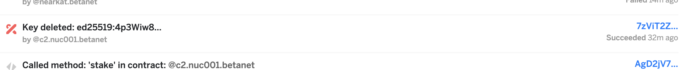

# Stake Wars Challenge 001
Published on: May 25th 2020

Create your BetaNet wallet, deploy your node, and correctly configure your staking pool.
This is designed to be your very first challenge: use it to understand how the staking pool works, and how to run a node.


## Acceptance Criteria

1. Generate your wallet
2. Lock your staking pool
3. Deploy your NEAR node
4. Configure your Staking Pool

## 1.Generate your wallet

You need [near-shell](https://github.com/near/near-shell), a Node.js application that relies on nearlib to generate secure keys, connect to the NEAR platform and send transactions to the network on your behalf.
You don't have to install near-shell on your validator node - on the contrary, it's suggested to keep your staking wallet on a different machine.

**Heads up:** please be sure to have Node version 10+ installed before trying to run near shell

1. Download `near-shell` with `npm install -g near-shell`
2. Set your NODE_ENV to betanet. You can do this in `bash` with the command `export NODE_ENV=betanet`
1. Create and `cd` a directory you'd like to work in, such as `mkdir stakewars && cd stakewars`
4. Run `near login` and copy/paste in your browser the link from the instructions on the screen
5. If you are not automatically redirected, write the `account_ID` you used in the browser on near-shell

**Heads up:** Even if you see an `ERR_CONNECTION_REFUSED` error in your browser, your login may be successful. So complete the step 5 and manually type your `account_ID` in near-shell.

This process is needed to authorize a `signer key` on your `account_ID`, enabling near-shell to control your wallet.

Once near-shell is ready, create the account `stakingPool_ID` for your staking pool. Launch the command `near create_account stakingPool_ID --masterAccount=account_ID`, where `stakingPool_ID` will be the address used by your delegators, and the name of your NEAR node.
This operation will create a new file in the folder `~/.near-credentials/betanet/` containing the private key of the staking pool.

## 2.Deploy your NEAR node

Setup your validator node following the [hardware requirements](https://docs.near.org/docs/roles/validator/hardware). If you use a firewall, set the rules to allow traffic to port `24567` from all IPs (0.0.0.0/0).
Once your machine is ready, install [nearup](https://github.com/near/nearup). Nearup provides simplified tools to run NEAR using Docker, and is designed to help developers who need a local RPC for their applications.

Take your time to understand how to manually update [nearcore](https://github.com/nearprotocol/nearcore), and how to properly use the command `nearup betanet --nodocker --binary-path` (see below for contribution opportunities).
To connect your node to `betanet` download and compile `nearcore` from its [beta branch](https://github.com/nearprotocol/nearcore/tree/beta).

**Heads up:** the first time you run `nearup` the application will ask your account ID:
```
Enter your account ID (leave empty if not going to be a validator):
```
Your validator node will run the staking pool, so the account to use is the `stakingPool_ID` and **not** the `account_ID`. After a few seconds, the node will generate its keys and complete the boot.

Export your validator key by typing the command `cat ~/.near/betanet/validator_key.json | grep public_key` as it will be needed to configure the staking pool contract.

## 3.Configure your Staking Pool

Setting up your node is just half of the fun! Below, the core part of this challenge. 

### 3.1. Preparation: unstake any currently locked funds and install Rustup

If you were already a validator on BetaNet, and you are using the legacy `near stake` command, follow the commands below before proceeding:
1. Issue `export NODE_ENV=betanet` command before performing any unstaking, so near-shell will connect to `betanet` RPC.
2. Unstake your previously locked funds, by setting stake to zero: `near stake account_ID <staking public key> 0` - where the public key and the account ID are the same you used when you initially issued the staking transaction.

Please note that your staked funds will require three epochs to be available (9 hours on BetaNet). Once the funds are unlocked, you can stop nearup with the command `nearup stop`, cleanup the folder `~/.near/betanet` on your validator node, and start nearcore again, repeating the command `nearup` from step 2 of this tutorial.

If you are running a previous version of the staking pool jump to **step 3.6** before proceeding.

Once your node is not anymore a validator, you can begin the deployment process of the staking pool:
1. Install Rustup: `curl --proto '=https' --tlsv1.2 -sSf https://sh.rustup.rs/ | sh`
2. If you receive the alert that is already present, be sure to update with the command `rustup update stable`
3. Setup the correct rustup target, with the command `rustup +stable target add wasm32-unknown-unknown`

Please note that some operating systems (such as Ubuntu Server) already come with Rust installed, but the available version may be outdated for NEAR. Refer to the official [Rustup website](https://rustup.rs/) for more specific instructions and troubleshooting.

### 3.2. Build the new staking pool contract

1. Open your `stakewars` work directory: `cd ~/stakewars`
2. Clone and deploy the staking pool contract: `git clone https://github.com/near/initial-contracts && cd initial-contracts/staking-pool`
3. Configure rustup with the supported target `rustup target add wasm32-unknown-unknown`
4. Build your staking pool contract: `./build.sh`

### 3.3. Launch your new validator node

2. Launch your node with the command `nearup betanet --nodocker`. Modify the launch command according to your actual validator configuration (e.g. `--nodocker` and `--binary-path` if you compiled your binaries)
3. Nearup may ask again for the validator ID to use. Put here your staking pool account (which we called `stakingPool_ID` in the steps above)
5. Note your validator public key on screen, or issue the command `cat ~/.near/betanet/validator_key.json |grep "public_key"` before going to the next step

### 3.4. Deploy your staking pool

1. From `near shell`, be sure that you are logged in and you have the key to manage `stakingPool_ID` account: `ls ~/.near-credentials/betanet`. If not present, recover your staking pool keys from the backup at the step 1 above, and copy them in the appropriate folder.
2. Deploy the staking pool contract on your account: `near deploy --accountId=stakingPool_ID --wasmFile=initial-contracts/staking-pool/res/staking_pool.wasm`
3. Proceed to initialize your staking pool account. In the example below the staking pool is `stakingPool_ID`, the owner account ID is `account_ID` and fees are 10%:
	```
	near call stakingPool_ID new '{"owner_id": "account_ID", "stake_public_key": "CE3QAXyVLeScmY9YeEyR3Tw9yXfjBPzFLzroTranYtVb", "reward_fee_fraction": {"numerator": 10, "denominator": 100}}' --account_id stakingPool_ID
	```
	Please node that `stake_public_key` can be with or without the `ed25519:` prefix.

You're almost there!

### 3.5. Delete the access keys and lock your staking pool

Use near-shell to delete any access keys to your staking pool. Please get confidence with this tool and lock the right keys, as it may destroy your funds by removing any access to your main wallet.
1. List the access keys of your staking pool contract: `near keys stakingPool_ID | grep public_key`
2. Lock your contract, by removing the keys associated with your contract: `near delete-key --accessKey <PUBKEY> --accountId stakingPoolID`

If successfully performed, you should see this entry on the [BetaNet explorer](https://explorer.betanet.near.org):



Confused? Read more on the differences between `signer keys`, `validator keys` and `node keys` in the official [documentation](https://docs.near.org/docs/validator/keys).

### 3.6. Delegate your own unstaked funds to the staking pool

1. From your near-shell machine, deposit the funds from your master account to the staking pool: `near call stakingPool_ID deposit '{}' --accountId account_ID --amount 100`
	Where 100 is the amount in NEAR tokens you want to deposit.
2. Stake your deposited funds, with the command `near call stakingPool_ID stake '{"amount": "100000000000000000000000000"}' --accountId account_ID`

**Heads up:** the amount that you deposit is in $NEAR, while the amount in the stake argument is in YoctoNEAR. `1` $NEAR is `1*10^24` YoctoNEAR (1 followed by 24 zeroes). Therefore:

| NEAR |  YoctoNEAR  | YoctoNEAR |
| ---- | ----------- | ----------------|
| `1` | `1*10^24` | `1000000000000000000000000` |
| `10` | `1*10^25` | `10000000000000000000000000` |
| `100` | `1*10^26` | `100000000000000000000000000` |
| `1,000` | `1*10^27` | `1000000000000000000000000000` |
| `10,000` | `1*10^28` | `10000000000000000000000000000` |

We strongly suggest to get confidence with the `staking pool` contract, by reading more on the official initial-contracts repo on [Github](https://github.com/near/initial-contracts/tree/master/staking-pool). Pay particular attention to the distinction between `stakingPool_ID` and `account_ID`.

### 3.7. Update an old version of the staking pool (optional)

The failsafe method is to deploy a new `stakingPool_ID` from step 1 of this challenge, unstake your funds from the old pool with the command `near call stakingPool_ID unstake`, and use them on the new pool. Only when the new node becomes validator, you can shut down the old node, and remove the pool.

At a high level, the steps to follow are:

1. View the total funds locked in the pool: `near view stakingPool_ID get_account_staked_balance '{"account_id": "account_ID"}'`
1. Unstake all your funds from the pool: `near call stakingPool_ID unstake '{"amount": "100007548461634906498130995"}' --accountId account_ID`
2. **IMPORTANT** Wait for 3 epochs (9 hours on BetaNet) to withdraw. Check if the stake is unlocked with the command `near view stakingPool_ID is_account_unstaked_balance_available '{"account_id": "account_ID"}' --accountId account_ID`
3. Once your funds are unlocked, withdraw them with the command `near call stakingPool_ID withdraw '{"amount": "100007548461634906498130995"}' --accountId account_ID`

Once completed, you are deady to get back to the step 3.2 and deploy a new staking pool contract.

## Contribution Opportunities

Do you want to earn extra tokens? We have contribution opportunities available below! 

Reply to the challenges application thread on [Github](https://github.com/nearprotocol/stakewars/issues/350) specifying:
- which contribution you want to do, and the link to the challenge
- the type of document you will release
- the date when you will publish the content (you can postpone a few days, no worries)

Once your work is done, you will be added to the list below. Please note that rewards in tokens will need to pass basic KYC checks from NEAR Foundation, and comply with regulations.

### List of available contributions

| Abstract | Description                    | Contributor | Due Date | Link | NEAR Tokens |
| -------- | ------------------------------ | ----------- | -------- | ---- | ----------- |
| How to compile nearcore | Create a tutorial, in the form of a video, a blogpost or Github document, that explains how to clone, compile and run `nearcore` from the beta branch, and prove that you can become validator with the process. Contributions in other languages are encouraged, but considered case by case basis. Updates to this guide, reflecting any updates of the tools involved, will be paid a % of the initial bounty per each revision, up to once per month, until Stake Wars is over. | - | - | - | 1,000 |
| Explain NEAR keys | Explain in the form of a video, a blogpost or Github document how `near login` works, how the authorization keys are generated, and how you can manage their backup and restore properly. Show in the guide the proof that you were able to run `near shell` on a different machine, without authorizing a new key. Contributions in other languages are encouraged, but considered on a case by case basis. Updates to this guide, reflecting any updates of the tools involved, will be paid a % of the initial bounty per each revision, up to once per month, until Stake Wars is over.  | - | - | - | 1,000 |


## Next Challenge
Enroll your staking pool, receive your delegation, and maintain your validator status: [challenge002](challenge002.md)
