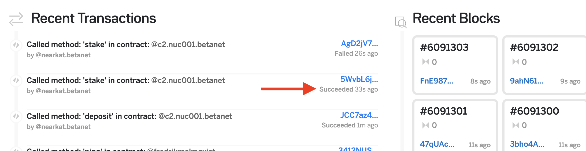
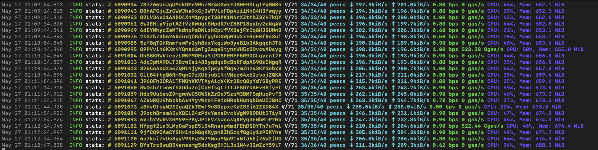

# Stake Wars Challenge 002
Published on: May 25th 2020

Enroll your staking pool, receive your delegation, and maintain your validator status!
This challenge is designed to learn how to keep track of your validator, and make your delegators happy.


## Acceptance Criteria

1. Enroll your staking pool
2. Receive your delegation
3. Check your validator status
4. Collect your fees!

## 1.Enroll your staking pool
As soon as you completed the Stake Wars [Challenge 001](challenge001.md), your node is ready to be on the roster of Stake Wars, and receive your first delegation. 
The process will need some basic expertise with `git`. Follow the instructions in the file [VALIDATORS.md](../VALIDATORS.md), and submit a pull request to the branch `update-validators-list`. 

## 2.Receive your delegation
NEAR team, and other Stake Wars participants, will keep an eye on the validators who deployed the staking pool, and will delegate some tokens to the ones of their choice. At the moment of writing, the cost of a validator seat on BetaNet is higher than 70,000 $NEAR, and there are only 100 seats available. With more than 120 validators already on the list (and growing), it will be difficult for you to attract delegation.

This step of the challenge requires that you have at least 100 tokens alread delegated to your staking pool. If you participated in the previous Stake Wars, and you already received BetaNet tokens in the past weeks, you can delegate all of them to your own pool.

Understand how to use the comamnd `near delete-key` from near-cli, and lock on your staking pool. Otherwise your pool will be listed, but you will not receive any delegation.
To verify if your pool is locked, use the command `near keys stakingPool_ID | grep length`. If the result is different than `[length]: 0`, your pool is not locked.

## 3.Check your validator status
You have five different ways to verify that your staking pool is successfully working, and you are a validator:
1. Check on BetaNet block explorer
2. Use the `near validators next | grep stakingPool_ID` on near-cli
3. Control the locked balance in your account, using `near state stakingPool_ID | grep locked` command
4. Check that `nearup` logs are displayng an uppercase "V"
5. A query to the JSON RPC using the `validator` endpoint

### 3.1.Check on the betanet block explorer
Visit the [betanet explorer](https://explorer.betanet.near.org) and check that your staking transaction succeeded:


### 3.2.Use near-cli
Use the command `near validators current` and `near validators next` to know who is currently running the network, a who will join next. The command `near validators next | grep stakingPool_ID` will show if your node will keep its seat in the next epoch.
Use `near validators next | grep 'seat price'` to know how big is the stake to become a validator.

### 3.3.Control the locked balance
Use the command `near state stakingPool_ID` to see the locked balance in your staking pool, and control if it is sufficient to earn a seat as a validator.

### 3.4.Check your nearup logs
Nearup logs can show if you are a validator or not. The `V/71` below shows that your node is one of the 71 validators running the network:


### 3.5.Query the JSON RPC
A combination of `curl` and `jq` can give you a trove of information about present and future validators:

```bash
curl -d '{"jsonrpc": "2.0", "method": "validators", "id": "dontcare", "params": [null]}' -H 'Content-Type: application/json' https://rpc.betanet.near.org -v | jq 
```

Instead of using only `jq`, add the filter `jq .result.current_proposals` to see the staking transactions that are pending.

### 4.Collect your fees!

If you configured your pool correctly, and you control the pool owner wallet, you should be able to unstake and withdraw the fees collected by your pool. These fees will be listed as normal stake in the account used as the owner of the staking pool.
Use the command `near view stakingPool_ID get_account_total_balance '{"account_id": "account_ID"}' --accountId=account_ID` to see the balance of the pool owner, and call the delegator functions to unstake and withdraw your funds.


## HEADS UP!

Always check that your `stakingPool_ID` and your validator node use the same ID and public_key. Otherwise, you will receive your delegation, your validator will receive a seat, but your node will not be able to create blocks!

With the command `near validators current | grep ' 0%'` you see those validators who got a seat, but generated 0% of the blocks. This means they will be kicked out in the next epoch (as you can see in `near validators next | grep 'Kicked'`), and their delegators will lose rewards.

Use the command `cat ~/.near/betanet/validator_key.json | grep 'public_key\|account_id'` and verify they are **exactly the same** of the values in current proposals (see `3.5` above). NEAR team (and other delegators) will unstake their tokens if you misconfigure your pool and you produce 0 blocks.

## Contribution Opportunities

Do you want to earn extra tokens? We have contribution opportunities available below! 

Reply to the challenges application thread on [Github](https://github.com/nearprotocol/stakewars/issues/350) specifying:
- which contribution you want to do, and the link to the challenge
- the type of document you will release
- the date when you will publish the content (you can postpone a few days, no worries)

Once your work is done, you will be added to the list below. Please note that rewards in tokens will need to pass basic KYC checks from NEAR Foundation, and comply with regulations.

### List of available contributions

| Abstract | Description                    | Contributor |  Date  | Link | NEAR Tokens | Maintenance | Languange |
| -------- | ------------------------------ | ----------- | ------ | ---- | ----------- | ----------- | --------- |
| Enroll your node | Create a tutorial, in the form of a video, a blogpost or Github document, that shows how to do a pull request to the VALIDATORS.md file, lock your contract, delegate some tokens, become a validator, and check that your pool and your node are correctly configured. Contributions in other languages are encouraged, but considered on a case by case basis. Updates to this guide, reflecting any updates of the tools involved, will be paid a % of the initial bounty per each revision, up to once per month, until Stake Wars is over. | @georgec138 | Jun 11 2020 | [Github](https://github.com/georgec138/near-docs/blob/master/Enroll-your-node_cn.md) | 1,000 | 10% | CN |
| Enroll your node | Same as above| @bonsfi | Jun 15 2020| [Github](https://github.com/georgec138/near-docs/blob/master/Enroll-your-node_cn.md) | 1,000 | 10% | ES |
| Enroll your node | Same as above | @wjdfx | Jun 15 2020| [Jianshu](https://www.jianshu.com/p/944a725c3d50) | 1,000 | 10% | CN |
| Enroll your node | Same as above | @dreamstaker | Jun 23 2020 | [Medium](https://link.medium.com/U4D8yiNBy7 ) | 1,000 | 10% | EN |
| Enroll your node | Same as above | @narniec | Jul 1 2020 | [Medium](https://medium.com/@narniec2020/%D1%80%D0%B5%D0%B3%D0%B8%D1%81%D1%82%D1%80%D0%B0%D1%86%D0%B8%D1%8F-%D0%BD%D0%BE%D0%B4%D1%8B-%D0%B2-%D1%81%D0%B5%D1%82%D0%B8-near-84c7df7ee701) | 1,000 | 10% | RU |
| Enroll your node | Same as above | @marshall-d-teach | Jul 6 2020 | [Github](https://github.com/marshall-d-teach/near-doc/) | 1,000 | 10% | EN |
| Enroll your node | Same as above | @youlaiwuqu | Sep 8 2020| [Jianshu](https://www.jianshu.com/p/39709af55d8a) | 1,000 | 10% | CN |
| Manage the pool | Create a tutorial, in the form of a video, a blogpost or Github document, that shows how to update the parameters of the staking pool, such as the fees and the validator key. Show also how to collect the fees and unstake them. Contributions in other languages are encouraged, but considered on a case by case basis. Updates to this guide, reflecting any updates of the tools involved, will be paid a % of the initial bounty per each revision, up to once per month, until Stake Wars is over. | @wjdfx | Jun 15 2020| [Jianshu](https://www.jianshu.com/p/b6b954e121c0) | 1,000 | 10% | CN |
| Manage the pool | Same as above | @narniec | Jun 16 2020 | [Github](https://link.medium.com/o0nn4kVzy7) | 1,000 | 10% | RU |
| Manage the pool | Same as above | @Vasya-kripto | Jul 1 2020 | [Medium](https://medium.com/@orang3club/manage-your-staking-pool-80709494cc63)| 1,000 | 10% | EN |
| Manage the pool | Same as above | @marshall-d-teach | Jul 6 2020 | [Github](https://github.com/marshall-d-teach/near-doc/) | 1,000 | 10% | EN |
| Manage the pool | Same as above | @Viacheslav198 | Jul 7 2020 | [Github](https://github.com/Viacheslav198/near/blob/master/pool.md) | 1,000 | 10% | RU |
| Manage the pool | Same as above | @48cfu | Aug 24 2020 | [Github](https://github.com/48cfu/near-documentazione/blob/master/diventare-validatore.md) | 1,000 | 10% | IT |
| Monitor uptime | Create a tutorial, in the form of a video, a blogpost or Github document, that shows how to automatically check the performance of your validator node, such as creating reports (per epoch, per day) and sending alerts via chat-bots or SMS if your node is stuck/kicked out and needs attention. Contributions in other languages are encouraged, but considered on a case by case basis. Updates to this guide, reflecting any updates of the tools involved, will be paid a % of the initial bounty per each revision, up to once per month, until Stake Wars is over. | @marco-sundsk | Jun 13 2020 | Github [EN](https://github.com/marco-sundsk/NEAR_DOC_zhcn/blob/master/StakeWar/near_monitor.md), [CN](https://github.com/marco-sundsk/NEAR_DOC_zhcn/blob/master/StakeWar/near_monitor_cn.md) | 1,000 | 10% | EN, CN |
| Monitor uptime | Same as above | @wjdfx | Jun 15 2020| [Jianshu](https://www.jianshu.com/p/6e197eeb63a0) | 1,000 | 10% | CN |
| Monitor uptime | Same as above | @marshall-d-teach | Jul 6 2020 | [Github](https://github.com/marshall-d-teach/near-doc/) | 1,000 | 10% | EN |
| Monitor uptime | Same as above | @masknetgoal634 | Aug 24 2020 | [Github](https://github.com/masknetgoal634/StakeWarsGuides/blob/master/Monitor-Uptime.md) | 1,000 | 10% | EN |
| Monitor uptime | Same as above | @youlaiwuqu | Sep 11 2020| [Jianshu](https://www.jianshu.com/p/e60764d1333c) | 1,000 | 10% | CN |
| Use Ledger Nano S | Create a tutorial, in the form of a video, a blogpost or Github document, that shows how to run `near shell` with your Ledger Nano S, from the seed key creation, to its backup and restore, to the delegation of funds to a staking pool. Contributions in other languages are encouraged, but considered on a case by case basis. Updates to this guide, reflecting any updates of the tools involved, will be paid a % of the initial bounty per each revision, up to once per month, until Stake Wars is over. | @wjdfx | Jun 15 2020| [Jianshu](https://www.jianshu.com/p/39b3562943e0) | 1,500 | 10% | CN |
| Use Ledger Nano S | Same as above | @narniec | Jul 1 2020 | [Medium](https://medium.com/@narniec2020/%D0%BF%D0%BE%D0%B4%D0%BA%D0%BB%D1%8E%D1%87%D0%B5%D0%BD%D0%B8%D0%B5-ledger-nano-s-%D0%B2-near-b536abfaaf7e)| 1,500 | 10% | RU |
| Use Ledger Nano S | Same as above | @Viacheslav198 | Jul 6 2020 | [Github](https://github.com/Viacheslav198/near/blob/master/ledger.md)| 1,500 | 10% | RU |
| Use Ledger Nano S | Same as above | @bonsfi | Jul 22 2020 | [Medium](https://medium.com/@bonsfi/como-usar-ledger-nano-s-como-key-en-nearprotocol-aac252dd374f) | 1,500 | 10% | ES |
| Use Ledger Nano S | Same as above | @48cfu | Aug 28 2020 | [Github](https://github.com/48cfu/near-documentazione/blob/master/ledger-nano-EN.md) | 1,500 | 10% | EN |
| Use Ledger Nano S | Same as above | @48cfu | Aug 28 2020 | [Github](https://github.com/48cfu/near-documentazione/blob/master/ledger-nano-IT.md) | 1,500 | 10% | IT |


## Next Challenge
Monitor your node health, and setup automated email alerts: [challenge003](challenge003.md)

## Previous Challenge
Create your BetaNet wallet, deploy your node, and correctly configure your staking pool: [challenge001](challenge001.md)


